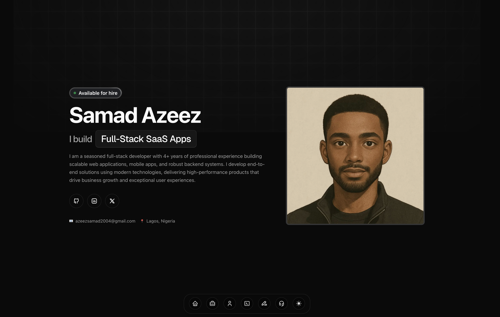

# Portfolio - Samad Azeez

A modern, responsive portfolio website showcasing my work as a full-stack developer with 4+ years of experience building scalable web applications, mobile apps, and robust backend systems.



## 🚀 About This Project

This portfolio serves as a comprehensive showcase of my professional journey, technical expertise, and notable projects. Built with modern web technologies, it features a clean, responsive design with smooth animations and an intuitive user experience. The site highlights my experience in full-stack development, from frontend React applications to backend APIs and mobile development with React Native.

## 🛠️ Tech Stack

### Frontend
- **Next.js 15.3.0** - React framework with App Router
- **React 19** - UI library
- **TypeScript** - Type-safe JavaScript
- **Tailwind CSS 4** - Utility-first CSS framework
- **Motion** - Animation library for smooth interactions
- **Radix UI** - Accessible component primitives
- **Tabler Icons** - Icon library
- **Next Themes** - Dark/light mode support

### UI Components
- **ShadCN/UI** - Reusable component library
- **Class Variance Authority** - Component variants
- **Tailwind Merge** - Utility class merging
- **Sonner** - Toast notifications

### Development & Tooling
- **pnpm** - Fast, disk space efficient package manager
- **ESLint** - Code linting
- **Prettier** - Code formatting
- **Husky** - Git hooks
- **Lint Staged** - Pre-commit linting
- **Commitlint** - Conventional commit messages

### Hosting & Deployment
- **Netlify** - Deployment platform
- **Git** - Version control

## ✨ Key Features

### 🎨 Modern Design
- Clean, minimalist interface with attention to detail
- Responsive design that works seamlessly across all devices
- Dark/light mode toggle for enhanced user experience
- Smooth scroll animations and micro-interactions

### 🏗️ Professional Sections
- **Hero Section** - Introduction with role highlights and social links
- **Experience Timeline** - Professional work history with detailed descriptions
- **Education** - Academic background and achievements
- **Skills & Technologies** - Comprehensive tech stack showcase
- **Featured Projects** - Detailed project showcases with live demos
- **Testimonials** - Client and colleague recommendations
- **Contact Information** - Multiple ways to connect

### 📱 Interactive Components
- **Expandable Project Cards** - Detailed project information on hover/click
- **Animated Testimonials** - Rotating testimonial carousel
- **Floating Navigation Dock** - macOS-style navigation
- **Mobile-Responsive Menu** - Optimized mobile navigation
- **Resume Download** - Direct PDF access

### 🎯 Performance Optimized
- Server-side rendering with Next.js
- Optimized images and assets
- Fast loading times
- SEO optimized with proper meta tags
- Accessibility compliant (WCAG guidelines)

## 🚀 Getting Started

### Prerequisites
- Node.js 18+ 
- pnpm (recommended) or npm

### Installation

1. **Clone the repository**
   ```bash
   git clone https://github.com/TheSamadAzeez/portfolio.git
   cd portfolio
   ```

2. **Install dependencies**
   ```bash
   pnpm install
   # or
   npm install
   ```

3. **Run the development server**
   ```bash
   pnpm dev
   # or
   npm run dev
   ```

4. **Open your browser**
   Navigate to [http://localhost:3000](http://localhost:3000) to see the portfolio.

### Available Scripts

```bash
# Development
pnpm dev          # Start development server with Turbopack
pnpm build        # Build for production
pnpm start        # Start production server
pnpm lint         # Run ESLint
pnpm format       # Format code with Prettier
pnpm typecheck    # Run TypeScript type checking

# Utilities
pnpm add-project  # Add new project (custom script)
```

## 📁 Project Structure

```
portfolio/
├── public/                 # Static assets
│   ├── images/            # Project and profile images
│   ├── icons/             # Favicon and app icons
│   └── resume.pdf         # Downloadable resume
├── src/
│   ├── app/               # Next.js App Router pages
│   │   ├── (landing)/     # Main portfolio pages
│   │   ├── components/    # Page-specific components
│   │   └── globals.css    # Global styles
│   ├── components/        # Reusable UI components
│   │   ├── ui/           # ShadCN components
│   │   ├── custom/       # Custom components
│   │   └── providers/    # Context providers
│   ├── data/             # Portfolio content and data
│   ├── hooks/            # Custom React hooks
│   ├── lib/              # Utility functions
│   └── types/            # TypeScript type definitions
├── components.json        # ShadCN configuration
├── tailwind.config.js     # Tailwind CSS configuration
└── next.config.ts         # Next.js configuration
```

## 🎨 Customization

### Adding New Projects

1. **Update portfolio data**
   ```typescript
   // src/data/portfolio-data.tsx
   export const portfolioData = {
     projects: [
       {
         id: 'your-project-id',
         title: 'Your Project Title',
         description: 'Brief description',
         // ... other project details
       }
     ]
   }
   ```

2. **Add project images**
   Place project images in `public/images/projects/`

3. **Create detailed project page** (optional)
   Add route in `src/app/(landing)/projects/[title]/`

### Modifying Content

All portfolio content is centralized in `src/data/portfolio-data.tsx`:
- Personal information and bio
- Work experience and education
- Skills and technologies
- Project details and links
- Testimonials and contact info

### Styling Customization

The project uses Tailwind CSS with a custom configuration:
- Color scheme: Defined in `tailwind.config.js`
- Component styles: Located in `src/components/ui/`
- Global styles: Found in `src/app/globals.css`

## 🔧 Development Process

### 1. Planning & Design
- **Research Phase**: Analyzed modern portfolio designs and UX patterns
- **Architecture Planning**: Structured components for reusability and maintainability
- **Tech Stack Selection**: Chose Next.js for performance and SEO benefits

### 2. Implementation
- **Component-First Approach**: Built reusable UI components with TypeScript
- **Responsive Design**: Implemented mobile-first design principles
- **Performance Optimization**: Utilized Next.js features for optimal loading

### 3. Content Strategy
- **Professional Storytelling**: Crafted compelling descriptions of experience and projects
- **Visual Hierarchy**: Organized information for easy scanning and engagement
- **SEO Optimization**: Implemented proper meta tags and structured data

### 4. Testing & Deployment
- **Cross-Browser Testing**: Ensured compatibility across major browsers
- **Mobile Responsiveness**: Tested on various device sizes
- **Performance Auditing**: Optimized for Core Web Vitals

## 📚 What I Learned

### Technical Skills
- **Advanced Next.js**: Mastered App Router, server components, and performance optimization
- **TypeScript Proficiency**: Implemented comprehensive type safety across the application
- **Modern CSS**: Leveraged Tailwind CSS for rapid, consistent styling
- **Component Architecture**: Designed scalable, reusable component systems
- **Animation Libraries**: Integrated smooth animations with Motion library

### Design & UX
- **User-Centered Design**: Created intuitive navigation and content organization
- **Accessibility**: Implemented WCAG guidelines for inclusive design
- **Performance Psychology**: Balanced visual appeal with loading performance
- **Responsive Strategy**: Developed mobile-first, progressive enhancement approach

### Professional Development
- **Portfolio Strategy**: Learned effective ways to showcase technical projects
- **Content Creation**: Developed skills in technical writing and project documentation
- **Personal Branding**: Created a cohesive professional online presence
- **Industry Standards**: Implemented modern development best practices

## 🚀 Performance Features

- **95+ Lighthouse Score** - Optimized for performance, accessibility, and SEO
- **Core Web Vitals Optimized** - Fast loading, responsive interactions
- **Image Optimization** - Next.js automatic image optimization
- **Bundle Optimization** - Code splitting and lazy loading
- **Caching Strategy** - Efficient static asset caching

## 🌐 Browser Support

- Chrome (latest)
- Firefox (latest)
- Safari (latest)
- Edge (latest)
- Mobile browsers (iOS Safari, Chrome Mobile)

## 📞 Contact & Collaboration

I'm always open to discussing new opportunities, collaborating on interesting projects, or simply chatting about the latest in tech.

- **Email**: [azeezsamad2004@gmail.com](mailto:azeezsamad2004@gmail.com)
- **LinkedIn**: [linkedin.com/in/thesamadazeez](https://linkedin.com/in/thesamadazeez)
- **GitHub**: [github.com/TheSamadAzeez](https://github.com/TheSamadAzeez)
- **Twitter**: [@thesamadazeez](https://twitter.com/thesamadazeez)
- **Portfolio**: [Live Demo](https://samadazeez.netlify.app/)

## 📄 License

This project is open source and available under the [MIT License](LICENSE).

---

**Built with ❤️ by Samad Azeez** - Full-Stack Developer passionate about creating exceptional digital experiences.
